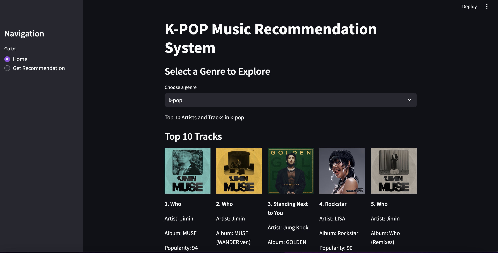
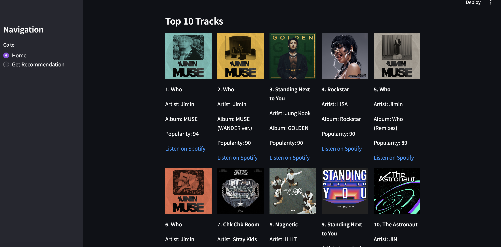
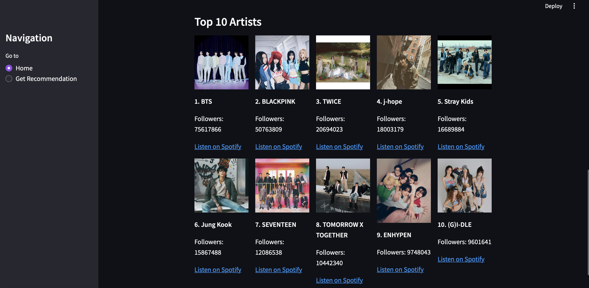
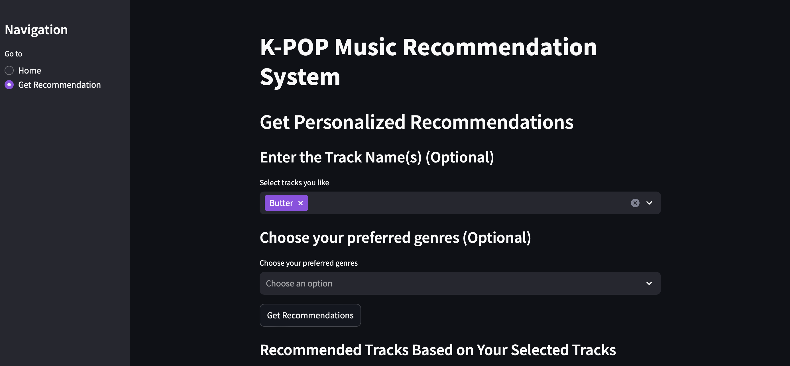
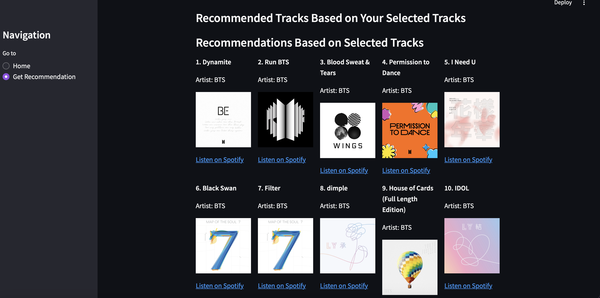
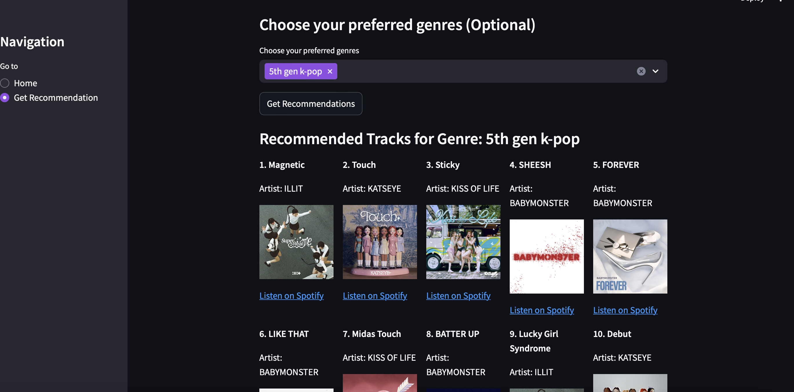

# K-POP Music Recommendation System

## Introduction

This application is designed to help users explore and discover new K-POP tracks and artists based on their preferences. By leveraging different recommendation techniques, the system provides personalized suggestions tailored to your musical tastes.

## Recommendation Systems
Recommendation systems are crucial in today's digital world for several reasons:
- **Personalization**: They enhance user experience by providing tailored content that matches individual preferences.
- **Discovery**: They help users discover new items or content they might not have found otherwise.
- **Engagement**: By suggesting relevant content, recommendation systems can increase user engagement and satisfaction.
- **Data Utilization**: They make effective use of vast amounts of user data and content information to deliver meaningful recommendations.

## Recommendation Methods Used

This app employs a mix of different recommendation techniques:
- **Popularity-Based Recommendations**: Recommends tracks and artists based on their popularity within a selected genre.
- **Content-Based Recommendations**: Provides recommendations based on the similarity of tracks to those the user has shown interest in.
- **Hybrid Recommendations**: Combines both popularity-based and content-based methods to offer more comprehensive and personalized suggestions.

## Data Details

The app uses data from Spotify via their Web API. Here’s what we’re working with:
- **Artists Data**: Includes artist names, IDs, images, and follower counts.
- **Tracks Data**: Contains track names, IDs, albums, popularity scores, and images.

### Data Files

- **`all_artists_data.csv`**: Data about K-POP artists.
- **`all_tracks_data.csv`**: Data about K-POP tracks including metadata and popularity information.

## Features

- **Explore Top Tracks and Artists**: Select a genre to view top tracks and artists.
- **Get Personalized Recommendations**: Input your favorite tracks and genres to receive tailored recommendations.
- **Genre Selection**: : Choose from a list of K-POP and Korean music genres.
- **Track and Artist Info**: View detailed information including track names, artist names, album names, popularity, and Spotify links.

## Getting Started

### Prerequisites

You’ll need:
- Python 3.x
- Streamlit
- pandas

To install the necessary packages, run:
```bash
pip install streamlit pandas
```

### SetUp 
- **Clone The Repository**: 
```bash
 git clone <repository-url>
 cd <repository-directory>
```
- **Prepare The Data**: Place your CSV data files (all_artists_data.csv and all_tracks_data.csv) in the data directory.

- **Run The App**: 
```bash 
streamlit run app.py
```
This will start the Streamlit server. 

 - **App** - You can access the app here:  [app](http://localhost:8501)

### Code Structure:
- app.py: Handles user interface, data loading, and recommendation logic.
- data_processing.py: Functions for loading, cleaning, and preparing the data.
- recommendation_system.py: Contains recommendation algorithms: popularity-based, content-based, and hybrid.

## Usage 

### Home Page 
- Genre Selection: Choose a genre to see top tracks and artists.
- Display: Top tracks and artists are shown with images, names, and Spotify links.

### Recommendation Page
- Track Selection: Optionally select tracks you like.
- Genre Preferences: Optionally select preferred genres.
- Get Recommendations: Click to generate personalized recommendations.

Below are some screenshots of the app GUI - 
- **Home Page**






- **Get Recommendations Page** 







